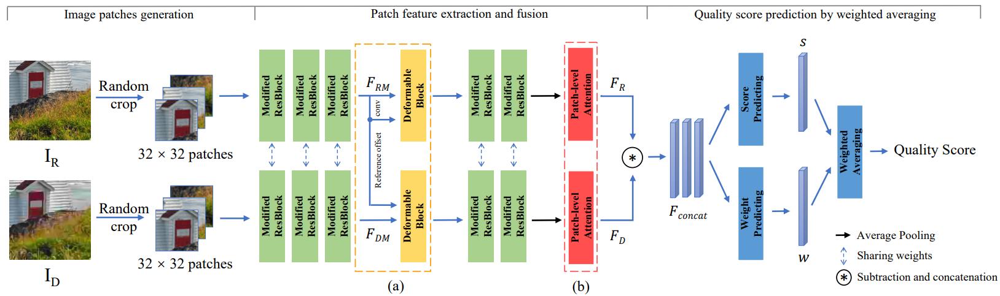
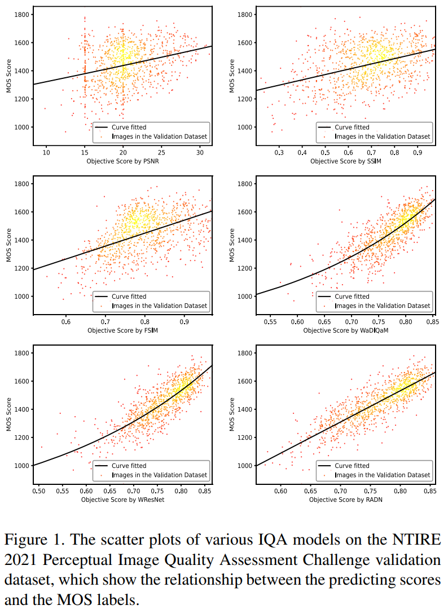
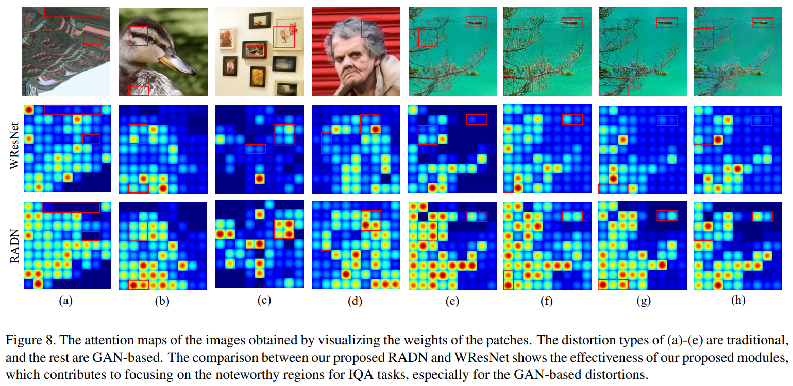

# RADN
[CVPRW 2021] Code for Region-Adaptive Deformable Network for Image Quality Assessment

[[Paper on arXiv]](https://arxiv.org/abs/2104.11599)

The codes of RADN are being refined and will be released soon...


## Overview
<p align="center">  </p>

## Update
[2021/5/7] add codes for WResNet (our baseline).

## Instruction
Fisrt, run mkdir.sh to create necessary directories.

Then you can simply use sh train.sh and sh test.sh to train and test the model. Also you can change the options in the shell files as you like.

The pretrained models can be found at this [URL](https://drive.google.com/file/d/1yxHPDDOHH7zmJ_cu1p_gk0yJ6Bo5qtn5/view?usp=sharing).


## Performance
### Scatter Plots
<p align="center">  </p>

### Attention Maps
<p align="center">  </p>

## Acknowledgments
The codes borrow heavily from WaDIQaM. Its implementation is from [Dingquan Li](https://github.com/lidq92/WaDIQaM) and we really appreciate it.

## Citation
```
@inproceedings{RADN2021ntire, 
title={Region-Adaptive Deformable Network for Image Quality Assessment}, 
author={Shuwei Shi and Qingyan Bai and Mingdeng Cao and Weihao Xia and Jiahao Wang and Yifan Chen and Yujiu Yang}, 
booktitle={IEEE/CVF Conference on Computer Vision and Pattern Recognition Workshops}, 
year={2021} 
}
```
