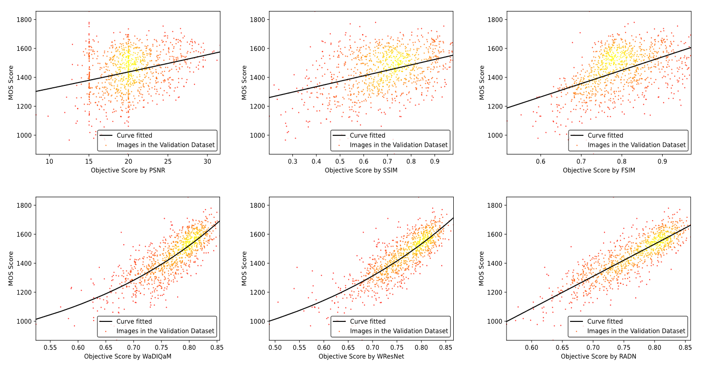

# RADN
[CVPRW 2021] Code for Region-Adaptive Deformable Network for Image Quality Assessment

[[Paper on arXiv]](https://arxiv.org/abs/2104.11599)

## Overview
<p align="center">  </p>

## Update
[2021/5/7] add codes for WResNet (our baseline).

[2021/5/29] add codes for RADN.
## Instruction
1. run `mkdir.sh` to create necessary directories.

2. use `sh train.sh` or `sh test.sh` to train or test the model. You can also change the options in the shell files as you like.

The pretrained models can be found at this [URL](https://drive.google.com/file/d/1yxHPDDOHH7zmJ_cu1p_gk0yJ6Bo5qtn5/view?usp=sharing).

Please note that the performance on the challenge leaderboard is obtained by ensembling and the checkpoint above is for the single model.

Note: Due to the instability of deformable convolution and self-attention in training, if there exist some problems during the training of RADN, don’t worry, you can try to load baseline weights to initialize RADN to achieve stable training and rapid convergence.
## Performance
### Scatter Plots
<p align="center">  </p>

### Attention Maps
<p align="center">  </p>

## Acknowledgment
The codes borrow heavily from WaDIQaM implemented by [Dingquan Li](https://github.com/lidq92/WaDIQaM) and we really appreciate it.

## Citation
If you find our work or code helpful for your research, please consider to cite:
```bibtex
@inproceedings{RADN2021ntire, 
title={Region-Adaptive Deformable Network for Image Quality Assessment}, 
author={Shuwei Shi and Qingyan Bai and Mingdeng Cao and Weihao Xia and Jiahao Wang and Yifan Chen and Yujiu Yang}, 
booktitle={IEEE/CVF Conference on Computer Vision and Pattern Recognition Workshops}, 
year={2021} 
}
```
